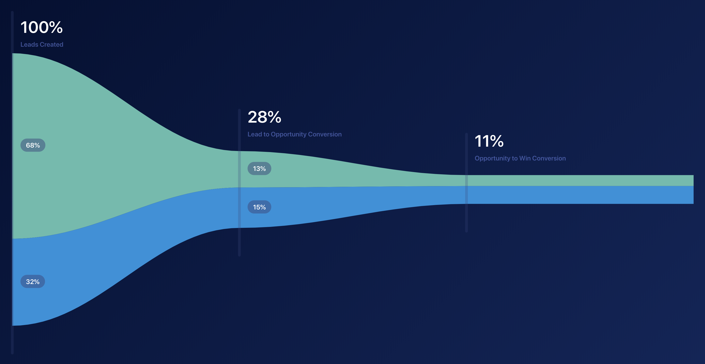

# Clearbit Funnel Demo
This supports an infinite number of conversion steps and infinite number of conversion sources -- in theory. Stylistically it is only semi-responsive. It is bound on a viewport that is always **1000** high, and is the width you set in `index.js` in `Funnel.prototype.dimensions` so there's some work to be done there.

### createBeizerSVGPath Method
This is the meat of making the curves on the chart (rather than geometric jagged lines), but it's a bit convoluted at this point. Will refactor. I used this site below to help me figure out the geometry to make nice curves dynamically, but I also tuned it by eye, hence all the static numbers.

http://blogs.sitepointstatic.com/examples/tech/svg-curves/cubic-curve.html

### Well known possible errors
If you have a non-matching number of data sources in each step, you will have a bad time. If they are out of order, you will have a bad time. I haven't bullet proofed it; it's probably worth doing checks on that to throw errors.

# Demo Image

